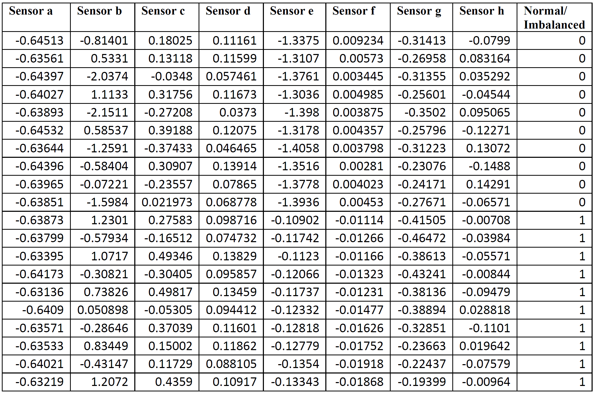
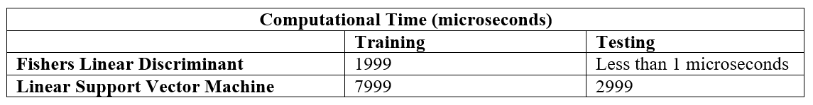
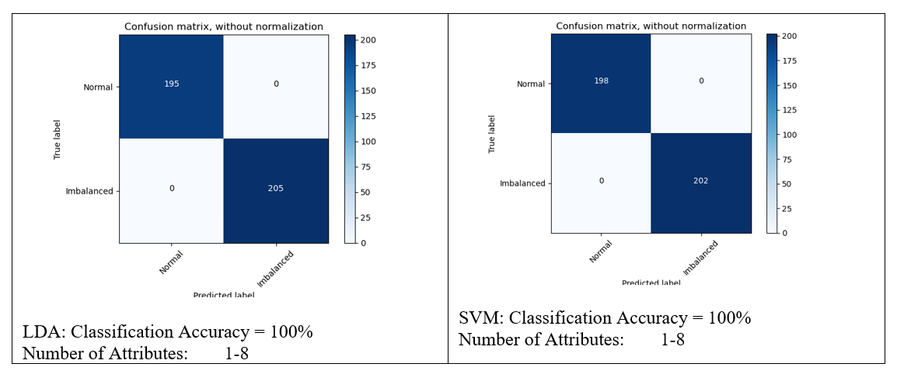
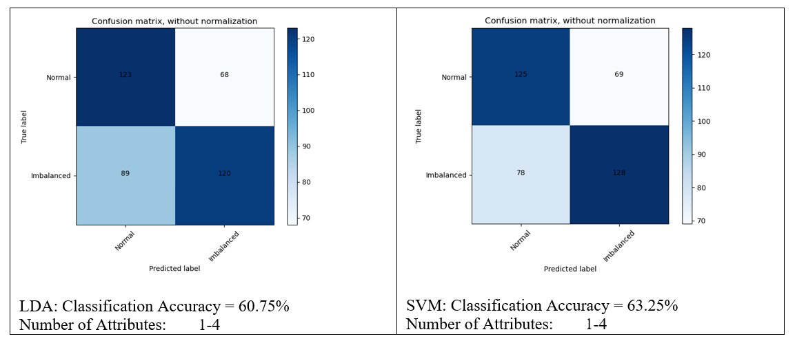
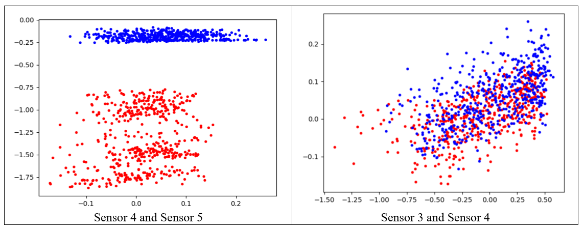

# Machine-Learning-classifiers-Fishers-Linear-Discrimination-VS-Linear-Support-Vector-Machine
Keeping NFL (no free lunch) theorem in machine learning in mind, the best way to find the best algorithm to solve a specific problem is put them on the test. The objective of this project is to classify Normal and Imbalanced operation of an Induction Electric Motor based on the recorded data from 8 different sensors. The following presents a portion of this 1000 data. In this dataset, Normal is classified as “0” and Imbalanced is classified as “1”.

Table below shows a sample of the test dataset.

Computation times and confusion matrix are used to compare the performance of two classifiers.
(a) Computational Times for both training and testing 

(b) A confusion matrix 

Feeding SVM and LDA with all 8 attributes results in the following confusion matrix:
Number of training data:	600
Number of test data:	400

It was found out, the results of some sensors leads to clear distinguishment between Normal and Balanced classes. So, the classification is run again with only considering the data from first 4 sensors. The results are as follows:
Number of training data:	600
Number of test data:	400

To demonstrate the reason behind this change in accuracy, a scatter plot from data distribution for sensor number 4 and sensor number 5 is drawn as shown in the figure below.

From the scatter plots above, it is clear that the Normal and Imbalanced classes based on data from sensor 4 and sensor 5 is easily recognizable while data from Sensor 3 and Sensor 4 have a huge overlap.

